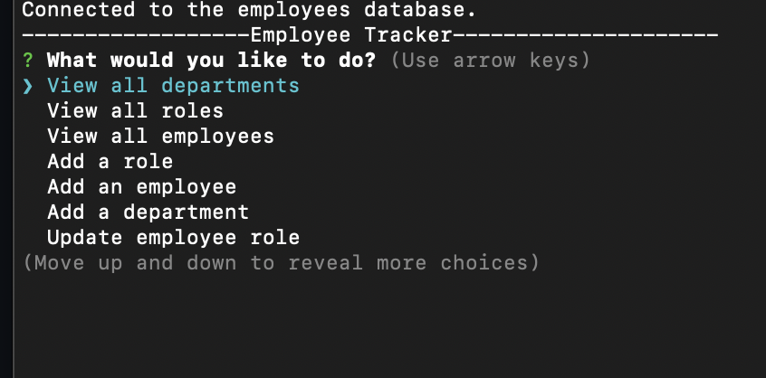

# Employee-Tracker

  
  
  ## Table of Contents
  -[Project Description](#projectDescription)
  -[Table of Contents](#tableofContents)
  -[Installation](#installation)
  -[Usage](#usage)
  -[License](#license)
  -[Contributing](#contributing)
  -[Tests](#tests)
  -[Questions](#questions)

  ## Project Description 
  An employee tracker for business use. It allows you to view employees, departments and roles. It also allows you to add employees, departments, and roles and update an employee role. It is made with Node.js, inquirer and express. It connects to a MySQL database to persist the data.

  
  
  
  
  ## Languages Used 
  Javascript,Node,Other

  ### Installation Instructions
  Install express, inquirer, MySQL2 and console.table by using the command <npm i express inquirer mysql2 console.table > from the command line. Also clone the code from the github repository.

  ### What will the app be used for? 
  It will be used to track employees and pertinent data.

  ### How can you contribute?
  Fork your own copy and have fun!

  ### Tests 
  n/a

  ### Credits and Contributors 
  n/a

  ### License
  This application is covered under the Open license
  

  ### Questions
  -------------------------------------------------------------------------------------------------------
  
  Check me out on Github!: (https://github.com/Jillium) 
  
  Any questions? Email at holmesjillanne@gmail.com